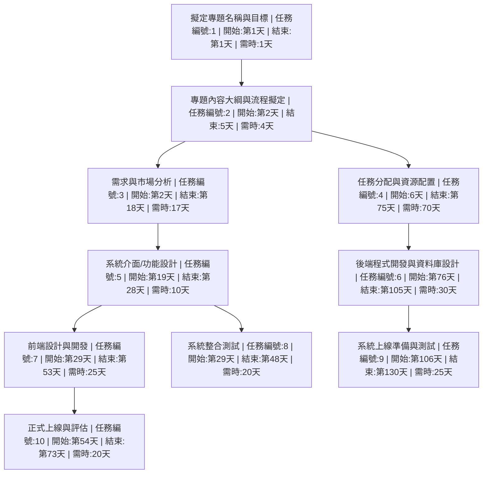
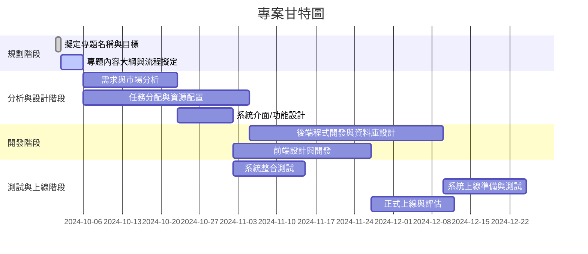

# 113_CourseTopics

|姓名|負責範圍|
|----|-------|
|劉育盈|資料收集與系統整合|
|楊凱婷|設備操作與系統整合|
|林予捷|資料收集與設備操作|

# PERT/CPM 圖

```mermaid
graph TD	
    no1["擬定專題名稱與目標 | 任務編號:1 | 開始:第1天 | 結束:第1天 | 需時:1天"] --> no2["專題內容大綱與流程擬定 | 任務編號:2 | 開始:第2天 | 結束:5天 | 需時:4天"]    
    no2 --> no3["需求與市場分析 | 任務編號:3 | 開始:第2天 | 結束:第18天 | 需時:17天"]
      
    no2 --> no4["任務分配與資源配置 | 任務編號:4 | 開始:6天 | 結束:第75天 | 需時:70天"]
    
    no3 --> no5["系統介面/功能設計 | 任務編號:5 | 開始:第19天 | 結束:第28天 | 需時:10天"]
    
    no4 --> no6["後端程式開發與資料庫設計 | 任務編號:6 | 開始:第76天 | 結束:第105天 | 需時:30天"]
    
    no5 --> no7["前端設計與開發 | 任務編號:7 | 開始:第29天 | 結束:第53天 | 需時:25天"]
    no5 --> no8["系統整合測試 | 任務編號:8 | 開始:第29天 | 結束:第48天 | 需時:20天"]
    
    no6 --> no9["系統上線準備與測試 | 任務編號:9 | 開始:第106天 | 結束:第130天 | 需時:25天"]
    
    no7 --> no10["正式上線與評估 | 任務編號:10 | 開始:第54天 | 結束:第73天 | 需時:20天"]
   
```

# 甘特圖

```mermaid
gantt
    title 專案甘特圖
    dateFormat  YYYY-MM-DD
    section 規劃階段
    擬定專題名稱與目標        :done,    a1, 2024-010-01, 1d
    專題內容大綱與流程擬定        :active,  a2, after a1, 4d

    section 分析與設計階段
    需求與市場分析           :         a3, after a2, 17d
    任務分配與資源配置        :        a4, after a2, 30d
    系統介面/功能設計                :       a5, after a3, 10d

    section 開發階段
    後端程式開發與資料庫設計      :        a6, after a4, 35d
    前端設計與開發           :        a7, after a5, 25d

    section 測試與上線階段
    系統整合測試            :        a8, after a5, 13d
    系統上線準備與測試        :        a9, after a6, 15d
    正式上線與評估           :        a10, after a7, 15d
```
