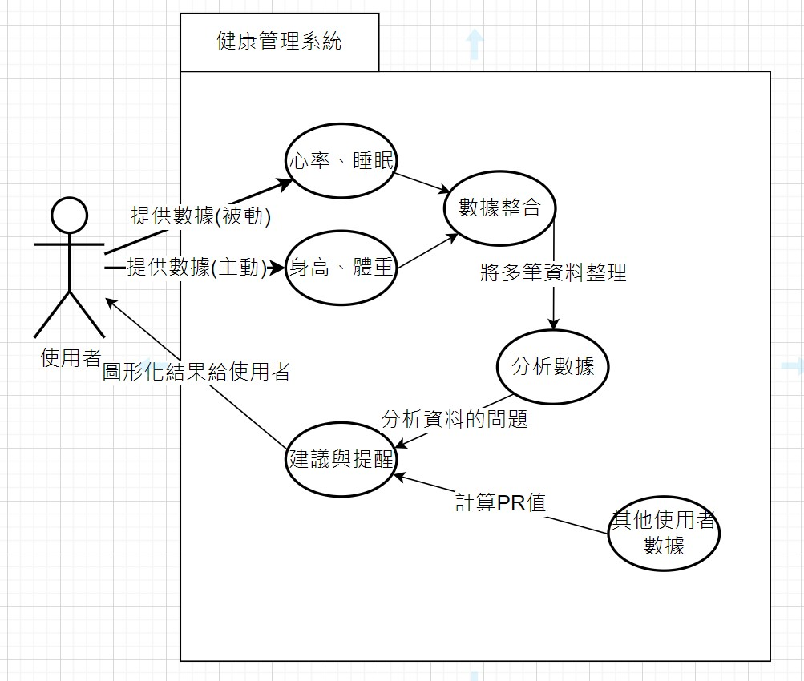

# 功能性需求

1. 數據收集與記錄
 * 支援多種健康數據的收集，ex:心率、步數、睡眠狀況
 * 提供手動和自動的數據輸入選項
 * 定期自動同步和備份數據
2. 個性化健康目標設定與提醒
 * 根據使用者的健康狀況和目標，個性化健康目標設置
 * 提供每日、每週、每月的健康目標追蹤
 * 健康目標達成情況提醒與提示

3. 數據分析與健康風險評估
 * 對收集的健康數據進行自動分析並生成報告
 * 健康風險評估與提示
 * 提供健康建議和行動計劃

# 非功能性需求
1. 系統性能
 * 支持高並發的數據處理能力，能同時處理多個使用者的數據
 * 迅速響應使用者操作，提供流暢的使用體驗
2. 資料安全
* 保護使用者的數據隱私，數據傳輸和存儲加密
* 定期進行安全性檢查和漏洞修補
3. 使用者體驗
* 提供直觀和友好的使用者界面
* 支持多種語言和文化背景的使用者
* 提供詳細的幫助文檔和使用教程

# 功能分解圖 (FDD)
# 健康管理系統功能分解圖 (FDD)

## 1. 數據收集與記錄
### 1.1 健康數據收集
- 1.1.1 支援多種健康數據收集
- 1.1.2 手動數據輸入
- 1.1.3 自動數據輸入

### 1.2 數據備份
- 1.2.1 定期自動同步數據
- 1.2.2 自動備份數據

## 2. 個性化健康目標設定與提醒
### 2.1 健康目標設定
- 2.1.1 設置個性化健康目標
- 2.1.2 手動設定健康目標

### 2.2 目標追蹤
- 2.2.1 每日健康目標追蹤
- 2.2.2 每週健康目標追蹤
- 2.2.3 每月健康目標追蹤

### 2.3 目標提醒
- 2.3.1 目標達成提醒
- 2.3.2 未達成目標的提示

## 3. 數據分析與健康風險評估
### 3.1 數據分析
- 3.1.1 自動分析健康數據
- 3.1.2 生成健康報告

### 3.2 健康風險評估
- 3.2.1 健康風險提示
- 3.2.2 提供健康建議和行動計劃

## 4. 系統性能
### 4.1 高並發數據處理
- 4.1.1 處理多個使用者的數據
- 4.1.2 系統負載均衡

### 4.2 系統響應速度
- 4.2.1 提供流暢的使用體驗

## 5. 資料安全
### 5.1 數據加密
- 5.1.1 數據傳輸加密
- 5.1.2 數據存儲加密

### 5.2 安全維護
- 5.2.1 定期進行安全檢查
- 5.2.2 定期修補安全漏洞

## 6. 使用者體驗
### 6.1 使用者界面
- 6.1.1 提供使用者界面

### 6.2 多語言支持
- 6.2.1 支持多種語言

### 6.3 使用幫助
- 6.3.1 提供詳細的幫助文檔
- 6.3.2 提供使用教程

# 使用案例圖

